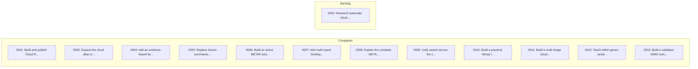

# Lore Index

> Auto-generated on 2026-06-16 11:49. Do not edit manually.
> Use `lore_generate-index` tool to regenerate.

Quick reference for task dependencies, status, and ADR relationships.

## Quick Stats

| Active | Blocked | Backlog | Completed | ADRs |
|:------:|:-------:|:-------:|:---------:|:----:|
| 0 | 0 | 1 | 12 | 0 |

## Dependency Graph

## Task Status

| ID | Title | Type | Status | Blocked By | Blocks | ADRs |
|:---|:------|:-----|:-------|:-----------|:-------|:-----|
| 0002 | [Research automatic cloud recognitio...](lore/1-tasks/backlog/0002_RESEARCH_automatic-cloud-recognition.md) | RESEARCH | backlog | — | — | — |
| 0001 | [Build and publish Cloud Recognition...](lore/1-tasks/archive/0001_FEATURE_cloud-recognition-v1/README.md) | FEATURE | completed | — | — | — |
| 0003 | [Expand the cloud atlas into a profe...](lore/1-tasks/archive/0003_FEATURE_encyclopedic-cloud-atlas/README.md) | FEATURE | completed | — | — | — |
| 0004 | [Add an evidence-based field observa...](lore/1-tasks/archive/0004_FEATURE_field-observation-assistant/README.md) | FEATURE | completed | — | — | — |
| 0005 | [Replace lesson summaries with an ho...](lore/1-tasks/archive/0005_FEATURE_quality-learning-curriculum/README.md) | FEATURE | completed | — | — | — |
| 0006 | [Build an active METAR and TAF train...](lore/1-tasks/archive/0006_FEATURE_metar-taf-training/README.md) | FEATURE | completed | — | — | — |
| 0007 | [Add multi-report briefings and spac...](lore/1-tasks/archive/0007_FEATURE_briefing-review-training.md) | FEATURE | completed | — | — | — |
| 0008 | [Explain the complete METAR anatomy](lore/1-tasks/archive/0008_FEATURE_metar-decode-anatomy/README.md) | FEATURE | completed | — | — | — |
| 0009 | [Unify search across the complete cl...](lore/1-tasks/archive/0009_FEATURE_unified-atlas-search.md) | FEATURE | completed | — | — | — |
| 0010 | [Build a practical Windy layer decod...](lore/1-tasks/archive/0010_FEATURE_windy-layer-decoder.md) | FEATURE | completed | — | — | — |
| 0011 | [Build a multi-image cloud recogniti...](lore/1-tasks/archive/0011_FEATURE_multi-image-recognition-bank.md) | FEATURE | completed | — | — | — |
| 0012 | [Teach within-genus variation with a...](lore/1-tasks/archive/0012_FEATURE_diagnostic-photo-gallery.md) | FEATURE | completed | — | — | — |
| 0013 | [Build a validated WMO nomenclature ...](lore/1-tasks/archive/0013_FEATURE_wmo-nomenclature-workshop.md) | FEATURE | completed | — | — | — |

## Architecture Decision Records

| ID | Title | Status | Related Tasks |
|:---|:------|:-------|:--------------|

## Legend

**Task Status:**
- `active` — Work can proceed
- `blocked` — Waiting on dependencies
- `backlog` — Planned but not yet started
- `completed` — Done, in archive

**Graph Arrows:**
- `A --> B` — A blocks B (B depends on A)
- `ADR -.-> Task` — ADR informs Task
